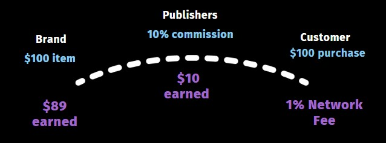

# What is Droplinked?

Droplinked is a commerce infrastructure network operating as a decentralized inventory management system for digital and physical goods. Droplinked allow brands to easily tie digital or physical products to NFTs, and distribute these quickly and transparently to publishers that help market and sell their products. Through multiple L1 blockchain integrations, brands can automatically and trustlessly coordinate with publishers to sell their products and settle value.\
\
Droplinked utilizes a token that streamlines compensation, swapped into whatever form of settlement preferred by an authenticated producer (manufacturer or company) or publisher (website, app or marketplace).

### Decentralized Registration of Products

Each item listed and sale generated is identified and instantly verifiably on-chain with variables associated with the item listing or goods (color, size, description, quantity, price, commission payout, etc.). Once a product's attributes have been defined, an NFT is minted which is then fractionalized through Droplinked's NFT Fractionalizer, with each NFT representing one unit of the product.

### Authorized Publishers

Brands & manufacturers may pre-authorize publishers which may sell and distribute their products, giving brands the power to select their partners and pre-define contract terms for affiliate sales. As these terms are defined through smart contracts on the Droplinked network, brands can simplify their distribution process and rest assured with maximum transparency and settlement guarantees.&#x20;

Through these publishers, brands can then deploy their products to multiple properties through headless solutions solutions that allow:

* NFT gates shops and items
* Co-selling
* Advanced Sales Tracking
* Loyalty Programs
* Etc.

### On-Chain Settlement

&#x20;

Manufacturers, creators, brands and customers all benefit from a decentralized network of smart contract powered product listings used for payout settlements with an ability to vote towards earned yield distributions. Valid network transactions initially recontribute 1% back into an escrow treasury vault for every conversion recorded.

###
