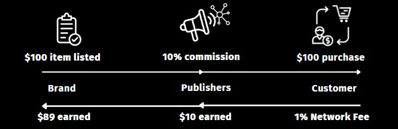

# What is droplinked?

Droplinked is a commerce infrastructure network operating as a decentralized inventory management system for digital and physical goods. Droplinked allows brands to easily tie digital or physical products to NFTs, and distribute these quickly and transparently to publishers that help market and sell their products. Through multiple L1 blockchain integrations, brands can automatically and trustlessly coordinate with publishers to sell their products and settle value.\
\
Droplinked utilizes a token that streamlines compensation, swapped into whatever form of settlement preferred by an authenticated producer (manufacturer or company) or publisher (website, app or marketplace).

### Decentralized Registration of Products

Each item listed and sale generated is identified and instantly verifiably on-chain with variables associated with the item listing or goods (color, size, description, quantity, price, commission payout, etc.). Once a product's attributes have been defined, an NFT is minted which is then fractionalized through Droplinked's NFT Fractionalizer, with each NFT representing one unit of the product.

### Authorized Publishers

Brands & manufacturers may pre-authorize publishers which may sell and distribute their products, giving brands the power to select their partners and pre-define contract terms for affiliate sales. As these terms are defined through smart contracts on the Droplinked network, brands can simplify their distribution process and rest assured with maximum transparency and settlement guarantees.&#x20;

Through these publishers, brands can then deploy their products to multiple properties through headless solutions solutions that allow:

* NFT gates shops and items
* Co-selling
* Advanced Sales Tracking
* Loyalty Programs
* Etc.

### On-Chain Settlement

Settlement of all customer sales and publisher compensation occurs on-chain, with immutable splits defined to producers, owners, distributors, affiliates and partners.

### Network Economics

1% of the value of all sales is automatically taken as a fee and reserved in the Droplinked Treasury. Additionally, Publishers and Brands can choose to receive a portion of their settlement value in DROPS tokens. For whatever portion they choose to receive in DROPS, a proportionate amount of the fiat value of their settlement is also reserved in the Droplinked Treasury.

Brands and Publishers that choose to receive a portion of their settlement in DROPS can stack their tokens and earn a yield from the total GMV sales of the network. This provides a mechanism for rewarding early adopters, who can quickly generate a stake in the future growth of the network.

###
