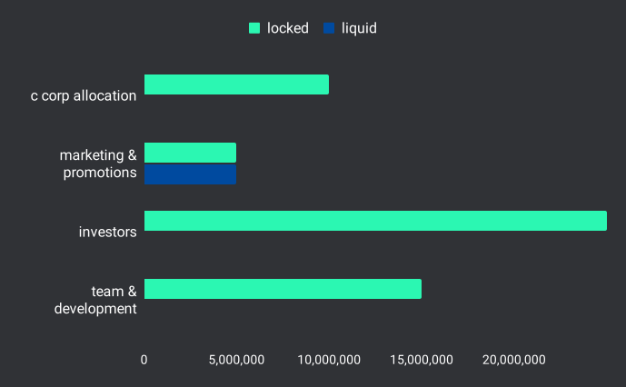

# tokenomics

DROPS token powers the networks decentralized governance and incentivizes long-term engagement for network contributors by providing an earned yield.

<figure><figcaption></figcaption></figure>

### emissions

Aside from the pre-allocated supply tokens used to incentivize investment and development, the only way for new DROPS tokens to be generated is through sales activity related to smart product contract (SPC) listings. These new tokens are allocated to contributors along the commerce supply chain, with pre-defined splits defined by the producer. Tokens are only distributed by the droplinked protocol once a sale is recorded and settled on-chain. As such, the aggregate amount of tokens paid to producers and publishers is variable, leading to a variable total supply based upon network activity.

|  pre-allocated supply  | amount (DROPS) |
| :--------------------: | :------------: |
|        investors       |   25,000,000   |
|   team & development   |   15,000,000   |
|    c corp allocation   |   10,000,000   |
| marketing & promotions |   10,000,000   |

Token distribution is locked into a 24 month duration with a 1 year release cliff from mainnet launch for the team and acquirers of the token warrant.

<figure><figcaption></figcaption></figure>

### network milestones

Yield payouts to DROPS stakers occur when the network hits sales milestones. These milestones are&#x20;

<figure><figcaption></figcaption></figure>

###

### framework & definitions

#### droplinked SPC pool

This allocation is reserved for the decentralized registration of products linked to smart contracts. When a manufacturer or producer lists an item through droplinked’s decentralized inventory management system, they define their payout amounts along with the % or commission fee paid to a publisher or promoter for generating the sale. By default, every conversion contributes 1% of each sale as a network fee back into the droplinked treasury vault.

#### droplinked SPC transactions

By default all product listings re-circulate 1% of every sale generated back into the droplinked treasury vault. Vault disbursements are pegged to deposited assets used for campaign and promotional activities with authenticated partners (brands, retailers, artists and projects) adopting the droplinked network. This incorporates any dapp, marketplace or company looking to streamline community marketing efforts through a native token with customers and creators.

#### droplinked treasury vault

Treasury accepts and retains USD/USDC/BTC/ETH/STX and more. Threshold milestones trigger yield payouts based on phases for the total amount of gross merchandise value sold across the network.

Tokens associated with droplinked smart product contract (SPC) listings are emitted based upon sales activity on the network
